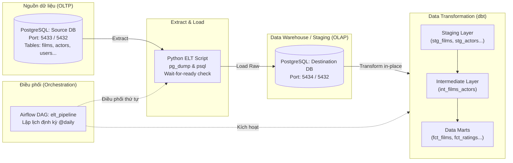

# 🎬 End-to-End ELT Pipeline with PostgreSQL, dbt & Apache Airflow

[](https://www.docker.com/)
[](https://www.postgresql.org/)
[](https://www.getdbt.com/)
[](https://airflow.apache.org/)
[](https://www.python.org/)

Dự án xây dựng hệ thống **ELT (Extract - Load - Transform)** hoàn chỉnh theo chuẩn Data Engineering hiện đại. Toàn bộ pipeline được container hóa bằng **Docker**, quản lý và biến đổi dữ liệu bằng **dbt**, và tự động hóa điều phối (Orchestration) bằng **Apache Airflow**.

---

## 📑 Mục lục
- [1. Kiến trúc hệ sinh thái (Architecture)](#1-kiến-trúc-hệ-sinh-thái-architecture)
- [2. Cấu trúc thư mục dự án](#2-cấu-trúc-thư-mục-dự-án)
- [3. Luồng hoạt động của Pipeline](#3-luồng-hoạt-động-của-pipeline)
  - [E & L: Extract & Load (Python)](#-e--l-extract--load-python)
  - [T: Transform (dbt)](#-t-transform-dbt)
  - [Orchestration (Apache Airflow)](#-orchestration-apache-airflow)
- [4. Thông số kết nối & Cổng dịch vụ (Ports & Credentials)](#4-thông-số-kết-nối--cổng-dịch-vụ-ports--credentials)
- [5. Hướng dẫn cài đặt và vận hành](#5-hướng-dẫn-cài-đặt-và-vận-hành)
- [6. Kiểm tra & Giám sát dữ liệu](#6-kiểm-tra--giám-sát-dữ-liệu)
- [7. Tài liệu bổ trợ & Debug](#7-tài-liệu-bổ-trợ--debug)

---

## 1. Kiến trúc hệ sinh thái (Architecture)



---

## 2. Cấu trúc thư mục dự án

```text
ELT/
├── airflow/                      # Cấu hình và DAGs của Apache Airflow
│   └── dags/
│       ├── airflow.cfg
│       └── elt_dag.py            # DAG chính: EL -> dbt run -> dbt test
├── elt/                          # Container xử lý Extract & Load
│   ├── Dockerfile                # Docker image tích hợp Python & postgresql-client
│   ├── crontab                   # Cấu hình crontab dự phòng
│   ├── elt-script.py             # Script trích xuất và nạp dữ liệu bằng pg_dump & psql
│   ├── pipeline.sh               # Bash script kích hoạt toàn bộ chuỗi EL + dbt
│   └── requirements.txt
├── elt_transform/                # Dự án dbt (Data Build Tool)
│   ├── analyses/                 # Các câu truy vấn ad-hoc phân tích (specific_movie.sql)
│   ├── macros/                   # Jinja SQL macros tái sử dụng (rating_category.sql)
│   ├── models/
│   │   ├── staging/              # Làm sạch dữ liệu thô (views)
│   │   ├── intermediate/         # Nối dữ liệu trung gian (views)
│   │   └── marts/                # Bảng Fact/Dimension phục vụ báo cáo (tables)
│   ├── dbt_project.yml           # File cấu hình chung dự án dbt
│   └── profiles.yml              # Kết nối dbt đến destination_db
├── source_db_init/
│   └── init.sql                  # Khởi tạo schema và nạp dữ liệu mẫu ban đầu
├── docker-compose.yaml           # Định nghĩa 7 services toàn hệ thống
├── GHI_CHU_LOI_VA_FIX.md         # Sổ tay tổng hợp lỗi Docker/Network & cách fix
├── .gitignore                    # Loại trừ .venv, logs, target dbt và secrets
└── README.md
```

---

## 3. Luồng hoạt động của Pipeline

### 🔄 E & L: Extract & Load (Python)
- File thực thi: [elt/elt-script.py](file:///d:/ELT/elt/elt-script.py)
- **Kiểm tra kết nối (`wait_for_postgres`)**: Liên tục kiểm tra bằng lệnh `pg_isready` để đảm bảo container PostgreSQL nguồn đã sẵn sàng nhận kết nối trước khi thực thi.
- **Extract**: Sử dụng tiện ích dòng lệnh `pg_dump` trích xuất toàn bộ schema và dữ liệu từ `source_db` ra file dump trung gian.
- **Load**: Sử dụng tiện ích `psql` để nạp dữ liệu nguyên bản trực tiếp vào `destination_db`.

### ⚡ T: Transform (dbt)
Dữ liệu thô trong `destination_db` được chuẩn hóa và tổng hợp qua mô hình phân tầng chuẩn dbt:
1. **Staging Layer (`staging`)**: Làm sạch kiểu dữ liệu, đổi tên cột chuẩn mực (ví dụ: `stg_films`, `stg_actors`, `stg_film_category`).
2. **Intermediate Layer (`intermediate`)**: Xử lý logic nghiệp vụ trung gian, kết hợp quan hệ n-n giữa phim và diễn viên (`int_films_actors`).
3. **Marts Layer (`marts`)**: Xây dựng các bảng Fact phục vụ trực tiếp cho báo cáo phân tích:
   - `fct_films`: Thông tin phim chi tiết kèm danh sách thể loại và diễn viên.
   - `fct_film_ratings`: Phân loại đánh giá phim dựa trên custom macro (`rating_category`).
   - `fct_category_summary`: Thống kê số lượng phim, giá trung bình và điểm rating theo thể loại.
   - `fct_actors_summary`: Thống kê số lượng phim tham gia của từng diễn viên.
4. **Data Testing**: Kiểm tra tính toàn vẹn (unique, not_null, accepted_values, relationships) thông qua `dbt test`.

### ⏱️ Orchestration (Apache Airflow)
- File DAG: [airflow/dags/elt_dag.py](file:///d:/ELT/airflow/dags/elt_dag.py)
- **Lịch chạy**: Chạy tự động hàng ngày (`schedule_interval='0 0 * * *'`), không backfill (`catchup=False`).
- **Thứ tự thực thi task**:
  $$\text{run\_elt\_script} \longrightarrow \text{run\_dbt\_run} \longrightarrow \text{run\_dbt\_test}$$
- Có cơ chế tự động thử lại (`retries: 1`, khoảng cách 5 phút) khi gặp sự cố mạng tạm thời.

---

## 4. Thông số kết nối & Cổng dịch vụ (Ports & Credentials)

| Dịch vụ | Port (Máy Host) | Port (Nội bộ Docker) | Database / User | Mật khẩu | Mục đích |
| :--- | :---: | :---: | :--- | :--- | :--- |
| **Source DB** | `5433` | `5432` | `source_db` / `postgres` | `secret` | Cơ sở dữ liệu nguồn (OLTP) |
| **Destination DB** | `5434` | `5432` | `destination_db` / `postgres` | `secret` | Kho lưu trữ dữ liệu (Warehouse) |
| **Airflow DB** | *(Không mở)* | `5432` | `airflow` / `airflow` | `airflow` | Lưu trữ metadata của Airflow |
| **Airflow Webserver** | `8080` | `8080` | User UI: `airflow` | `password` | Giao diện điều phối Airflow UI |

> [!NOTE]
> Khi kết nối từ các phần mềm quản trị database bên ngoài (DBeaver, pgAdmin, DataGrip), hãy sử dụng port của máy Host (`5433` cho Source, `5434` cho Destination).

---

## 5. Hướng dẫn cài đặt và vận hành

### Yêu cầu tiên quyết
- Đã cài đặt [Docker Desktop](https://www.docker.com/products/docker-desktop/) và đang bật.
- Git.

### Khởi động toàn bộ hệ thống
1. Clone dự án (nếu chuyển máy):
   ```bash
   git clone https://github.com/Accnoname/ELT.git
   cd ELT
   ```
2. Khởi chạy tất cả các containers với Docker Compose:
   ```bash
   docker-compose up -d --build
   ```
3. Kiểm tra trạng thái các container:
   ```bash
   docker-compose ps
   ```

### Truy cập giao diện Airflow
- Mở trình duyệt và truy cập: [http://localhost:8080](http://localhost:8080)
- Đăng nhập:
  - **Username**: `airflow`
  - **Password**: `password`
- Tìm DAG `elt_pipeline` và bật toggle sang **Active** (hoặc bấm nút **Trigger DAG** để chạy ngay lập tức).

---

## 6. Kiểm tra & Giám sát dữ liệu

### Chạy kiểm tra dbt thủ công (Optional)
Nếu muốn chạy biến đổi hoặc kiểm thử dbt độc lập bên trong container:
```bash
# Chạy toàn bộ model transform
docker-compose run --rm dbt run --profiles-dir /root --project-dir /dbt

# Chạy kiểm thử chất lượng dữ liệu
docker-compose run --rm dbt test --profiles-dir /root --project-dir /dbt
```

### Chạy phân tích mẫu (Analysis)
Để biên dịch truy vấn thông tin của một bộ phim cụ thể (ví dụ: *Inception*):
```bash
docker-compose run --rm dbt compile --select specific_movie --vars "{'movie_title': 'Inception'}" --profiles-dir /root --project-dir /dbt
```

---

## 7. Tài liệu bổ trợ & Debug

Trong quá trình phát triển và vận hành Docker Compose đa container, nếu bạn gặp các lỗi phổ biến về kết nối nội bộ hoặc sai lệch port:
👉 Xem chi tiết cách xử lý tại: [GHI_CHU_LOI_VA_FIX.md](file:///d:/ELT/GHI_CHU_LOI_VA_FIX.md).
