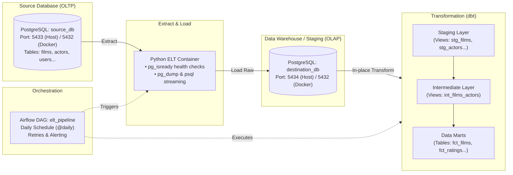

# 🎬 Production-Grade ELT Pipeline with PostgreSQL, dbt & Apache Airflow

[](https://www.docker.com/)
[](https://www.postgresql.org/)
[](https://www.getdbt.com/)
[](https://airflow.apache.org/)
[](https://www.python.org/)

An end-to-end, automated **ELT (Extract, Load, Transform)** data pipeline designed with modern Data Engineering best practices. The entire system is containerized with **Docker Compose**, transforms data using **dbt**, and is orchestrated and scheduled using **Apache Airflow**.

---

## 📑 Table of Contents
- [1. Architecture Overview](#1-architecture-overview)
- [2. Repository Structure](#2-repository-structure)
- [3. Pipeline Mechanics](#3-pipeline-mechanics)
  - [Extract & Load (EL)](#-extract--load-el)
  - [Transform (dbt)](#-transform-dbt)
  - [Orchestration (Apache Airflow)](#-orchestration-apache-airflow)
- [4. Service Ports & Credentials](#4-service-ports--credentials)
- [5. Getting Started](#5-getting-started)
- [6. Testing & Data Quality](#6-testing--data-quality)
- [7. Debugging & Common Issues](#7-debugging--common-issues)

---

## 1. Architecture Overview



---

## 2. Repository Structure

```text
ELT/
├── airflow/                      # Apache Airflow configurations & DAGs
│   └── dags/
│       ├── airflow.cfg
│       └── elt_dag.py            # Primary DAG: EL -> dbt run -> dbt test
├── elt/                          # Extract & Load service
│   ├── Dockerfile                # Custom Python image with postgresql-client
│   ├── crontab                   # Standalone cron configuration
│   ├── elt-script.py             # Custom EL script using pg_dump and psql
│   ├── pipeline.sh               # Shell script executing end-to-end pipeline
│   └── requirements.txt
├── elt_transform/                # dbt (Data Build Tool) project
│   ├── analyses/                 # Ad-hoc analysis queries (specific_movie.sql)
│   ├── macros/                   # Reusable Jinja macros (rating_category.sql)
│   ├── models/
│   │   ├── staging/              # Raw data cleaning & type casting (Views)
│   │   ├── intermediate/         # Entity relationships & joins (Views)
│   │   └── marts/                # Dimensional fact & analytical tables (Tables)
│   ├── dbt_project.yml           # Core dbt project settings
│   └── profiles.yml              # Database connection profile for dbt
├── source_db_init/
│   └── init.sql                  # Source OLTP schema definition & seed data
├── docker-compose.yaml           # Multi-container orchestration (7 services)
├── GHI_CHU_LOI_VA_FIX.md         # Troubleshooting & Docker network debug notes
├── .gitignore                    # Excludes .venv, logs, dbt target & credentials
└── README.md
```

---

## 3. Pipeline Mechanics

### 🔄 Extract & Load (EL)
- **Script**: [elt/elt-script.py](file:///d:/ELT/elt/elt-script.py)
- **Resilience (`wait_for_postgres`)**: Continuously polls the PostgreSQL server using `pg_isready` with configurable retries before attempting connection.
- **Extraction**: Leverages native PostgreSQL tooling (`pg_dump`) to export schema definitions and data from `source_db`.
- **Loading**: Directly streams the extracted payload into `destination_db` using `psql`.

### ⚡ Transform (dbt)
The raw data loaded into the target warehouse is modeled using modular layered architecture:
1. **Staging Layer (`models/staging`)**: Cleanses column names, standardizes data types, and defines source contracts (`stg_films`, `stg_actors`, `stg_film_category`).
2. **Intermediate Layer (`models/intermediate`)**: Denormalizes many-to-many associations between films and actors (`int_films_actors`).
3. **Marts Layer (`models/marts`)**: Persisted as physical database tables for downstream BI and analytics:
   - `fct_films`: Enriched movie catalog with aggregated actor rosters and genres.
   - `fct_film_ratings`: Evaluates rating buckets using custom Jinja macros (`rating_category`).
   - `fct_category_summary`: Aggregated KPIs (count, average price, rating) grouped by genre.
   - `fct_actors_summary`: Actor performance and participation metrics.
4. **Data Integrity Testing**: Automatically validates uniqueness, not-null constraints, and referential integrity using `dbt test`.

### ⏱️ Orchestration (Apache Airflow)
- **DAG Definition**: [airflow/dags/elt_dag.py](file:///d:/ELT/airflow/dags/elt_dag.py)
- **Schedule**: Executes daily at midnight (`0 0 * * *`) with `catchup=False`.
- **Dependency Flow**:
  $$\text{run\_elt\_script} \longrightarrow \text{run\_dbt\_run} \longrightarrow \text{run\_dbt\_test}$$
- **Fault Tolerance**: Configured with automatic retries (`retries: 1`, 5-minute backoff) for transient network or database connectivity hiccups.

---

## 4. Service Ports & Credentials

| Service | Host Port | Internal Port | Database / User | Password | Role |
| :--- | :---: | :---: | :--- | :--- | :--- |
| **Source DB** | `5433` | `5432` | `source_db` / `postgres` | `secret` | OLTP Source Database |
| **Destination DB** | `5434` | `5432` | `destination_db` / `postgres` | `secret` | OLAP Data Warehouse |
| **Airflow DB** | *(Internal)* | `5432` | `airflow` / `airflow` | `airflow` | Airflow Metadata Store |
| **Airflow Webserver** | `8080` | `8080` | `airflow` (UI Login) | `password` | Orchestration Management UI |

> [!NOTE]
> To inspect tables using database GUIs (such as DBeaver, DataGrip, or pgAdmin), connect using `localhost` with host ports `5433` (Source) and `5434` (Destination).

---

## 5. Getting Started

### Prerequisites
- [Docker Desktop](https://www.docker.com/products/docker-desktop/) installed and running.
- [Git](https://git-scm.com/).

### Spin up the Environment
1. Clone the repository:
   ```bash
   git clone https://github.com/Accnoname/ELT.git
   cd ELT
   ```

2. Build and start all services in detached mode:
   ```bash
   docker-compose up -d --build
   ```

3. Check service health:
   ```bash
   docker-compose ps
   ```

### Accessing Apache Airflow
- Navigate to: **[http://localhost:8080](http://localhost:8080)**
- Credentials:
  - **Username**: `airflow`
  - **Password**: `password`
- Toggle the `elt_pipeline` DAG to **Active** or trigger a manual run by clicking the **Trigger DAG** button.

---

## 6. Testing & Data Quality

### Manual dbt Execution
Run transformations or data quality assertions on-demand inside the container:
```bash
# Execute transformations
docker-compose run --rm dbt run --profiles-dir /root --project-dir /dbt

# Run automated tests
docker-compose run --rm dbt test --profiles-dir /root --project-dir /dbt
```

### Parameterized Analysis Queries
Compile parameterized analyses (e.g. querying a specific title like *Inception*):
```bash
docker-compose run --rm dbt compile --select specific_movie --vars "{'movie_title': 'Inception'}" --profiles-dir /root --project-dir /dbt
```

---

## 7. Debugging & Common Issues

For common troubleshooting scenarios encountered during multi-container networking, port-binding discrepancies, or database authentication:
👉 Refer to the detailed guide: [GHI_CHU_LOI_VA_FIX.md](file:///d:/ELT/GHI_CHU_LOI_VA_FIX.md).
