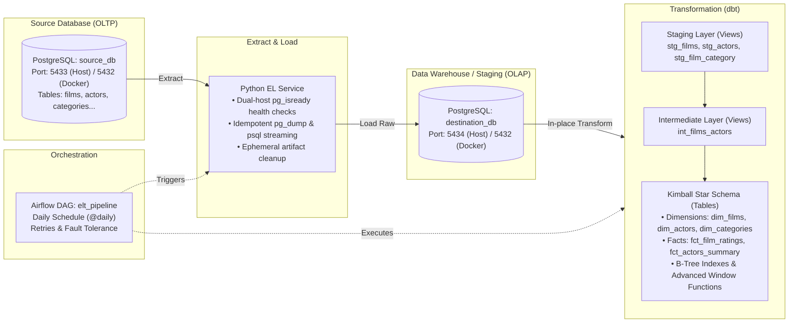

# 🎬 Automated ELT Data Pipeline: PostgreSQL, dbt & Apache Airflow

[](https://www.docker.com/)
[](https://www.postgresql.org/)
[](https://www.getdbt.com/)
[](https://airflow.apache.org/)
[](https://www.python.org/)

An end-to-end, automated **ELT (Extract, Load, Transform)** data pipeline simulating an enterprise data warehousing architecture. Built as a local multi-container development environment using **Docker Compose**, data transformation modeled using **dbt** with a **Kimball Star Schema**, and orchestrated via **Apache Airflow**.

---

## 📑 Table of Contents
- [1. Architecture Overview](#1-architecture-overview)
- [2. Key Engineering Highlights](#2-key-engineering-highlights)
- [3. Repository Structure](#3-repository-structure)
- [4. Pipeline Mechanics](#4-pipeline-mechanics)
  - [Idempotent Extract & Load (EL)](#-idempotent-extract--load-el)
  - [Dimensional Modeling & Window Functions (dbt)](#-dimensional-modeling--window-functions-dbt)
  - [Orchestration (Apache Airflow)](#-orchestration-apache-airflow)
- [5. Database Optimization & Indexing](#5-database-optimization--indexing)
- [6. Local Development Credentials & Ports](#6-local-development-credentials--ports)
- [7. Quickstart Guide](#7-quickstart-guide)
- [8. Testing & Quality Assurance](#8-testing--quality-assurance)
- [9. Production Transition & Future Improvements](#9-production-transition--future-improvements)

---

## 1. Architecture Overview



---

## 2. Key Engineering Highlights

- **True Idempotent EL Pipeline**: Ingestion script implements clean drop-and-replace semantics (`--clean --if-exists --no-owner --no-privileges`), eliminating duplicate primary keys and schema collisions during daily reruns.
- **Kimball Dimensional Modeling**: Unlike basic summary models, data is structured into dedicated **Dimensions** (`dim_films`, `dim_actors`, `dim_categories`) and **Fact Tables** (`fct_film_ratings`, `fct_actors_summary`, `fct_category_summary`).
- **Advanced SQL & Window Functions**: Demonstrates advanced analytical computations:
  - `DENSE_RANK() OVER (PARTITION BY ... ORDER BY ...)`: Global and genre-specific performance rankings.
  - `NTILE(4) OVER (...)`: Rating quartile segmentation.
  - `PERCENT_RANK() OVER (...)`: Actor percentile evaluation across the global catalog.
  - Benchmark alpha comparisons: Calculating deviations against dynamic cohort averages (`user_rating - AVG(user_rating) OVER (PARTITION BY category)`).
- **Database Index Optimization**: Configures target B-Tree indexes directly via dbt table configurations to accelerate downstream analytical queries and join plans.
- **Referential Integrity Testing**: Tests enforce uniqueness, not-null constraints, and foreign key `relationships` between fact and dimension tables.

---

## 3. Repository Structure

```text
ELT/
├── airflow/
│   └── dags/
│       └── elt_dag.py            # Streamlined Airflow DAG (EL -> dbt run -> dbt test)
├── elt/
│   ├── Dockerfile                # Lightweight Python + postgresql-client container
│   ├── elt-script.py             # Idempotent EL script with health checks
│   ├── pipeline.sh               # Local execution entrypoint
│   └── requirements.txt
├── elt_transform/                # dbt Project
│   ├── analyses/
│   │   ├── specific_movie.sql    # Parameterized ad-hoc query
│   │   └── query_plan_analysis.sql # EXPLAIN ANALYZE demonstration
│   ├── macros/
│   │   └── rating_category.sql   # Reusable Jinja macro for rating tiering
│   ├── models/
│   │   ├── staging/              # Type casting and source contracts (Views)
│   │   ├── intermediate/         # Entity denormalization (Views)
│   │   └── marts/                # Star Schema dimensions & analytical facts (Tables)
│   │       ├── dim_films.sql
│   │       ├── dim_actors.sql
│   │       ├── dim_categories.sql
│   │       ├── fct_film_ratings.sql
│   │       ├── fct_actors_summary.sql
│   │       ├── fct_category_summary.sql
│   │       ├── fct_films.sql
│   │       └── schema.yml        # Model descriptions & integrity assertions
│   ├── dbt_project.yml           # Core dbt configurations
│   └── profiles.yml              # Warehouse connection profile
├── source_db_init/
│   └── init.sql                  # Source OLTP schema & sample data
├── docker-compose.yaml           # Multi-service infrastructure declaration
├── GHI_CHU_LOI_VA_FIX.md         # Troubleshooting & Docker networking guide
├── .gitignore                    # Excludes .venv, logs, target artifacts & secrets
└── README.md
```

---

## 4. Pipeline Mechanics

### 🔄 Idempotent Extract & Load (EL)
- **Source Code**: [elt/elt-script.py](elt/elt-script.py)
- **Dual Health Checks**: Employs `pg_isready` polling against both `source_postgres` and `destination_postgres` before launching database operations.
- **Idempotency Strategy**: Uses `pg_dump` with `--clean --if-exists --no-owner --no-privileges`. When triggered on a daily cadence or retry loop, previously landed tables are cleanly dropped and refreshed without schema conflict or primary key violation.
- **Resource Discipline**: Ephemeral dump files are unlinked immediately after ingestion to prevent disk bloat.

### ⚡ Dimensional Modeling & Window Functions (dbt)
The analytical layer adheres to modern dimensional modeling patterns:

1. **Staging Layer (`models/staging`)**:
   Standardizes column names, casts timestamps and decimals, and establishes explicit contracts (`stg_films`, `stg_actors`, `stg_film_category`).
2. **Intermediate Layer (`models/intermediate`)**:
   Resolves many-to-many associations between titles and actors (`int_films_actors`).
3. **Marts Layer (`models/marts`) - Kimball Star Schema**:
   - [dim_films.sql](elt_transform/models/marts/dim_films.sql): Film dimension enriched with primary genre extraction, full genre rollups, and cast rosters.
   - [dim_actors.sql](elt_transform/models/marts/dim_actors.sql): Actor dimension capturing debut date, career span years, and primary genre specialty.
   - [dim_categories.sql](elt_transform/models/marts/dim_categories.sql): Genre dimension with catalog share calculation.
   - [fct_film_ratings.sql](elt_transform/models/marts/fct_film_ratings.sql): Fact table integrating rental prices, rating metrics, cohort rankings (`DENSE_RANK`, `NTILE`), and genre-level benchmark comparisons.
   - [fct_actors_summary.sql](elt_transform/models/marts/fct_actors_summary.sql): Actor productivity metrics with global percentile distribution (`PERCENT_RANK`).

### ⏱️ Orchestration (Apache Airflow)
- **DAG Definition**: [airflow/dags/elt_dag.py](airflow/dags/elt_dag.py)
- **Scheduling**: Configured to run daily (`@daily`, `0 0 * * *`) with `catchup=False`.
- **Clean Architecture**: Cleaned up unused operator imports to maintain code hygiene.
- **Execution Flow**:
  $$\text{run\_elt\_script} \longrightarrow \text{run\_dbt\_run} \longrightarrow \text{run\_dbt\_test}$$

---

## 5. Database Optimization & Indexing

To ensure optimal query performance when analytical consumers join fact and dimension tables, B-Tree indexes are declared within dbt table configurations:

```sql
{{ config(
    materialized = 'table',
    indexes = [
      {'columns': ['film_id'], 'unique': True, 'type': 'btree'},
      {'columns': ['primary_category'], 'type': 'btree'},
      {'columns': ['release_year'], 'type': 'btree'}
    ]
) }}
```

### Query Execution Plan Analysis
See [elt_transform/analyses/query_plan_analysis.sql](elt_transform/analyses/query_plan_analysis.sql) for execution plan validation. Downstream queries filtering on `primary_category` or joining on `film_id` utilize Index Scans rather than expensive Sequential Table Scans (`Seq Scan`).

---

## 6. Local Development Credentials & Ports

> [!NOTE]
> The credentials below are **default configurations for local Docker container development**. In a live deployment, credentials should be injected via environment variables or secret managers (see [Production Transition](#9-production-transition--future-improvements)).

| Service | Host Port | Container Port | Database / User | Local Dev Password |
| :--- | :---: | :---: | :--- | :--- |
| **Source DB (OLTP)** | `5433` | `5432` | `source_db` / `postgres` | `secret` |
| **Destination DB (OLAP)** | `5434` | `5432` | `destination_db` / `postgres` | `secret` |
| **Airflow UI** | `8080` | `8080` | User: `airflow` | `password` |

---

## 7. Quickstart Guide

### Prerequisites
- [Docker Desktop](https://www.docker.com/products/docker-desktop/) (running)
- [Git](https://git-scm.com/)

### Run the Pipeline
1. Clone the repository:
   ```bash
   git clone https://github.com/Accnoname/ELT.git
   cd ELT
   ```
2. Launch the infrastructure:
   ```bash
   docker-compose up -d --build
   ```
3. Verify running containers:
   ```bash
   docker-compose ps
   ```
4. Access the Airflow UI at **[http://localhost:8080](http://localhost:8080)** and trigger the `elt_pipeline` DAG.

---

## 8. Testing & Quality Assurance

Run dbt models and automated assertions on-demand:
```bash
# Run all transformations
docker-compose run --rm dbt run --profiles-dir /root --project-dir /dbt

# Execute data quality assertions (uniqueness, not null, relationships)
docker-compose run --rm dbt test --profiles-dir /root --project-dir /dbt
```

---

## 9. Production Transition & Future Improvements

While this project is architected to demonstrate core data engineering design principles, deploying to an enterprise cloud environment would involve the following enhancements:

1. **Secret & Credential Management**: Replace plaintext configuration in compose files with AWS Secrets Manager, GCP Secret Manager, or HashiCorp Vault, injecting credentials via `.env` or IAM roles.
2. **Object Store Storage**: Decouple database dumps from local disk by streaming snapshots to Cloud Object Storage (e.g., AWS S3, Google Cloud Storage) with partition-based lifecycle policies.
3. **Incremental Ingestion & CDC**: For high-volume production tables, migrate full-dump snapshots to Change Data Capture (CDC via Debezium) or incremental dbt materializations (`is_incremental()`).
4. **Data Observability**: Integrate monitoring tools such as [Elementary](https://www.elementary-data.com/) or Great Expectations for real-time data freshness, anomaly detection, and schema change alerting.
